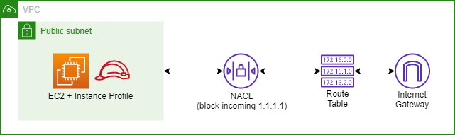

# Topics
- EC2
- EC2 Session Manager
- IAM
- VPCs
- Subnets
- Route tables
- NACLs

### Diagram

---

## Exercise 1
Create VPC, IGW, subnet, and route table.
- [AWS::EC2::SubnetRouteTableAssociation](https://docs.aws.amazon.com/AWSCloudFormation/latest/UserGuide/aws-resource-ec2-subnet-route-table-assoc.html)

**Verify:** 
- Observe network components in VPC console.

---

## Exercise 2
Create IAM role for logging into an EC2 instance.
- [EC2 Instance Profile example](https://docs.aws.amazon.com/systems-manager/latest/userguide/setup-instance-profile.html)

**Verify:**
- Observe role in IAM console.

---

## Exercise 3 
Create EC2 instance that uses the instance profile.

**Verify:** 
- Connect to instance via Session Manager in EC2 console.
- Confirm successful (0% packet loss) ping to `1.1.1.1`.

---

## Exercise 4 
Block all pings to `1.1.1.1`.

- [Subnet NACL association](https://docs.aws.amazon.com/AWSCloudFormation/latest/UserGuide/aws-resource-ec2-subnet-network-acl-assoc.html)

**Verify:** 
- Confirm failed (100% packet loss) ping to `1.1.1.1`.