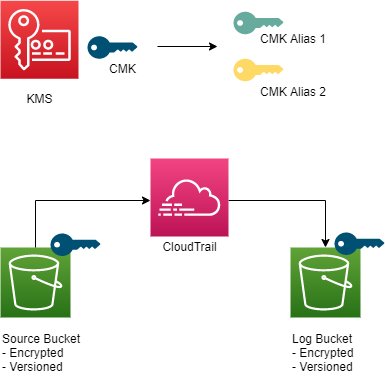

# Topics
- KMS
- Cloudtrail

### Additional command line parameter: 
```--parameters ParameterKey=BucketSuffix,ParameterValue=foo```

### Diagram



---

## Exercise 1 
Create a CMK key with only administrative permissions. Create two buckets, encrypt one with CMK.
- [CMK administration](https://docs.aws.amazon.com/kms/latest/developerguide/key-policies.html#key-policy-default-allow-administrators)
- [Setting the principal](https://aws.amazon.com/premiumsupport/knowledge-center/update-key-policy-future/)

**Verify:** 
- Observe blocked access to encrypted bucket.

---

## Exercise 2
Create a Cloudtrail Trail that delivers data to an unencrypted bucket.
- [Trail](https://docs.aws.amazon.com/AWSCloudFormation/latest/UserGuide/aws-resource-cloudtrail-trail.html)

**Verify:** 
- Observe Cloudtrail logs in unencrypted bucket.

---

## Exercise 3 
Extend the CMK with Cloudtrail policies. Create a Cloudtrail Trail that delivers data to an encrypted bucket.
- [KMS policy for Cloudtrail](https://docs.aws.amazon.com/awscloudtrail/latest/userguide/create-kms-key-policy-for-cloudtrail.html)

**Verify:** 
- Observe Cloudtrail logs in encrypted bucket.

---

## Exercise 4
Create two aliases for the CMK.
- [AWS::KMS::Alias](https://docs.aws.amazon.com/AWSCloudFormation/latest/UserGuide/aws-resource-kms-alias.html)

**Verify:**
- Observe aliases in KMS console.