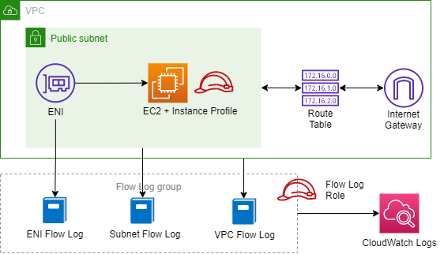

# Topics
- Network Interface
- Flow Logs

### Diagram

---

## Exercise 1
Create a VPC, an EC2 instance, and a Session Manager role.
- Refer to previous exercise(s) if necessary.

**Verify:**
- Use Session Manager to connect to the EC2 instance.

---

## Exercise 2
Create a flow log for the VPC.
- [Flow Logs](https://docs.aws.amazon.com/vpc/latest/userguide/flow-logs.html)

**Verify:**
- View Flow Logs on the VPC.

---

## Exercise 3
Create a flow log for the subnet.

**Verify:**
- View Flow Logs on the subnet.

---

## Exercise 4
Create an ENI and an ENI flow log.
- [AWS::EC2::NetworkInterface](https://docs.aws.amazon.com/AWSCloudFormation/latest/UserGuide/aws-resource-ec2-network-interface.html)
- [AWS::EC2::NetworkInterfaceAttachment](https://docs.aws.amazon.com/AWSCloudFormation/latest/UserGuide/aws-resource-ec2-network-interface-attachment.html)

**Verify:**
- View Flow Logs on the Network Interface.