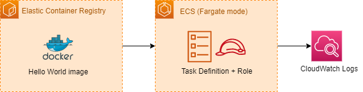

# Topics
- ECS (Fargate mode)
- ECR 
- LaunchTemplate

### Diagram

---

## Exercise 1
Create an ECR repository for the Docker Official `hello-world` image.
- [Official Hello World Image](https://hub.docker.com/_/hello-world)
- [Docker image rate limits](https://docs.docker.com/docker-hub/download-rate-limit/)
- [Pushing Docker image to ECR](https://docs.aws.amazon.com/AmazonECR/latest/userguide/getting-started-cli.html)

**Verify:** 
- Push the `hello-world` image to the ECR repository.

---

## Exercise 2 
Create a log group. Create the task execution role.
- [Task execution role](https://docs.aws.amazon.com/AmazonECS/latest/developerguide/task_execution_IAM_role.html)
    
**Verify:** 
- Observe role and group in AWS console.

---

## Exercise 3 
Create Fargate cluster and task definition.
- [ECS Cluster](https://docs.aws.amazon.com/AWSCloudFormation/latest/UserGuide/aws-resource-ecs-cluster.html)
- [Task Definition](https://docs.aws.amazon.com/AWSCloudFormation/latest/UserGuide/aws-resource-ecs-taskdefinition.html)
- [Docker image inspect](https://docs.docker.com/engine/reference/commandline/inspect/)

**Verify:**
- Observe task and container definitions in ECS console.

---

## Exercise 4 
Add log group configuration to task container, then run `/hello` command in Fargate mode (without creating a service).
- [Container log configuration](https://docs.aws.amazon.com/AWSCloudFormation/latest/UserGuide/aws-properties-ecs-taskdefinition-containerdefinitions-logconfiguration.html)

**Verify:**
- See output from `/hello` in Cloudwatch.
