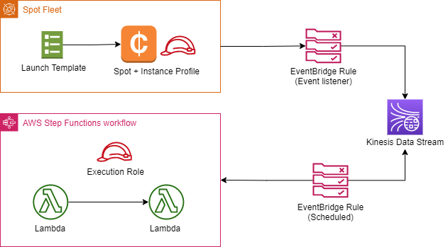

# Topics
- Spot fleets
- Kinesis
- Event bridge
- Step functions

### Diagram



---

## Exercise 1
Create a spot fleet and its role. Set the `Type` of the fleet to  'maintain', and `ReplaceUnhealthyInstances` to `true`.
- [Spot Fleet prerequisites](https://docs.aws.amazon.com/AWSEC2/latest/UserGuide/spot-fleet-requests.html#spot-fleet-prerequisites)
- [AWS::EC2::SpotFleet](https://docs.aws.amazon.com/AWSCloudFormation/latest/UserGuide/aws-resource-ec2-spotfleet.html)
- [AmazonEC2SpotFleetTaggingRole](https://docs.aws.amazon.com/batch/latest/userguide/spot_fleet_IAM_role.html)

**Verify:**
- Using the EC2 console, terminate an instance. Confirm that the fleet replaces it after a few minutes.

---

## Exercise 2
Create a Kinesis stream. Create an EventBridge rule that targets the stream for any EC2SpotFleet event.
- [AWS::Events::Rule](https://docs.aws.amazon.com/AWSCloudFormation/latest/UserGuide/aws-resource-events-rule.html)
- [AWS::Kinesis::Stream](https://docs.aws.amazon.com/AWSCloudFormation/latest/UserGuide/aws-resource-kinesis-stream.html)
- [Stream fundamentals](https://docs.aws.amazon.com/streams/latest/dev/fundamental-stream.html)
- [Shard iterator operations](https://docs.aws.amazon.com/cli/latest/reference/kinesis/get-shard-iterator.html)

**Verify:**
- After terminating an instance, use the current Unix timestamp to query the shard. Confirm records are present after a few minutes.

  ```SHARD_ITERATOR=$(aws kinesis get-shard-iterator --shard-id shardId-000000000000 --shard-iterator-type AT_TIMESTAMP --timestamp <timestamp> --stream-name <streamname> --query 'ShardIterator') && aws kinesis get-records --shard-iterator $SHARD_ITERATOR```

---

## Exercise 3
Create a step function with at least two Lambdas. 
- [AWS::StepFunctions::StateMachine](https://docs.aws.amazon.com/AWSCloudFormation/latest/UserGuide/aws-resource-stepfunctions-statemachine.html)
- [States language](https://docs.aws.amazon.com/step-functions/latest/dg/concepts-amazon-states-language.html)

**Verify:**
- Confirm successful execution using the States console.
- Confirm lambda execution logs are present in Cloudwatch.

## Exercise 4
Create an EventBridge rule that targets the step function on a schedule.
- [Schedule expressions](https://docs.aws.amazon.com/AmazonCloudWatch/latest/events/ScheduledEvents.html)

**Verify:**
- Observe successful executions in `Executions` tab of States console.