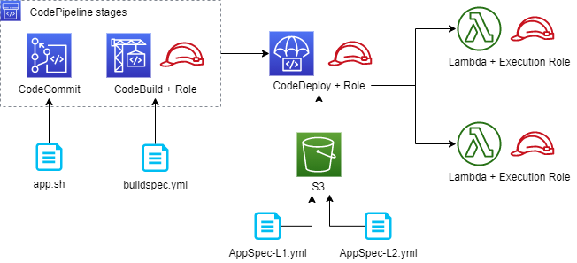

# Topics
- CodeCommit
- CodeBuild
- CodeDeploy
- CodePipeline

### Diagram

---

## Exercise 1
Create a CodeCommit repository. Use the IAM console to generate credentials for it. Create a simple `app.sh` file which displays output when run.
- [AWS::CodeCommit::Repository](https://docs.aws.amazon.com/AWSCloudFormation/latest/UserGuide/aws-resource-codecommit-repository.html)
- [Generating CodeCommit credentials](https://docs.aws.amazon.com/codecommit/latest/userguide/setting-up-gc.html)

**Verify:**
- Run `app.sh` locally.
- Commit `app.sh` to the repository.

---

## Exercise 2
Create a CodeBuild Build Project which sources the CodeCommit repository. Add a `buildspec.yml` file to the repository.
- [AWS::CodeBuild::Project Source](https://docs.aws.amazon.com/AWSCloudFormation/latest/UserGuide/aws-properties-codebuild-project-source.html)
- [buildspec.yml examples](https://docs.aws.amazon.com/codebuild/latest/userguide/build-spec-ref.html#build-spec-ref-example)

**Verify:**
- Confirm a successful build using the CodeBuild console.
- Echo `pwd` inside of the buildspec.
- Run `app.sh` from inside of the buildspec.

---

## Exercise 3
Create a CodeDeploy Application and Deployment Group. Create two Lambdas, then publish, alias, and manually deploy them with AppSpec files from S3.
- Note: CloudFormation does not currently support specifying the `Deployment` property for Lambdas, so this step must be done manually.
- [AWS::CodeDeploy::DeploymentGroup Deployment](https://docs.aws.amazon.com/AWSCloudFormation/latest/UserGuide/aws-properties-codedeploy-deploymentgroup-deployment.html)
- [AppSpec file for Lambdas](https://docs.aws.amazon.com/codedeploy/latest/userguide/application-revisions-appspec-file.html#add-appspec-file-lambda)
- `aws s3api put-object --bucket <bucket name> --body AppSpec-L1.yml --key AppSpec-L1.yml --profile <profile name>`

**Verify:**
- Use the AppSpec files to reverse the deployment.

---

## Exercise 4
Create a CodePipeline with two stages: SOURCE, and BUILD. Use the CodeCommit repository and the Build Project. Add an `artifacts` section to the buildspec.
- [AWS::CodePipeline::Pipeline](https://docs.aws.amazon.com/AWSCloudFormation/latest/UserGuide/aws-resource-codepipeline-pipeline.html)
- [CodeCommit action structure](https://docs.aws.amazon.com/codepipeline/latest/userguide/action-reference-CodeCommit.html)
- [CodeBuild action structure](https://docs.aws.amazon.com/codepipeline/latest/userguide/action-reference-CodeBuild.html)

**Verify:**
- Confirm pipeline runs after committing and pushing a minor change to `app.sh`.
- Confirm the `buildspec` artifacts are appearing in the bucket.

---

## Extension: Connect CodeDeploy to the CodePipeline

At this point, the architectural path becomes somewhat convoluted. 

Ideally, the `AppSpec` files could be output artifacts of the CodeBuild stage, leading neatly into a `CodeDeploy` stage.

CodeDeploy can accept an `AppSpec` file as an input artifact (see [CodeDeploy stage action](https://docs.aws.amazon.com/codepipeline/latest/userguide/action-reference-CodeDeploy.html)).

However, CodeBuild only outputs artifacts in a compressed format. [source](https://stackoverflow.com/questions/53136089) and [source](https://forums.aws.amazon.com/thread.jspa?messageID=864336). 

Although multiple workarounds are possible, it is outside the scope of the exercise to bridge the two.
