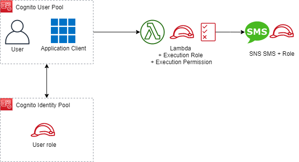

# Topics
- Cognito user pools
- Cognito app clients
- Cognito identity pool
- Cognito LambdaConfig

### Diagram

---

## Exercise 1 
Create a Cognito user pool, configured to send an SMS when a user is created. Add parameters for the user name and phone number, and create a user.
- [AWS::Cognito::UserPool](https://docs.aws.amazon.com/AWSCloudFormation/latest/UserGuide/aws-resource-cognito-userpool.html)
- [AWS::Cognito::UserPoolUser](https://docs.aws.amazon.com/AWSCloudFormation/latest/UserGuide/aws-resource-cognito-userpooluser.html)
- [SNS role](https://docs.aws.amazon.com/config/latest/developerguide/sns-topic-policy.html)

**Verify:** 
- Receive an SMS when the template has created the user.

---

## Exercise 2
Customize the sign up SMS message with a lambda configuration.
- [Cognito Lambda triggers](https://docs.aws.amazon.com/cognito/latest/developerguide/cognito-user-identity-pools-working-with-aws-lambda-triggers.html)

**Verify:**
- Receive a customized SMS when the template has created the user.

---

## Exercise 3
Add an app client to the user pool.
- [Cognito cURL comnmand](https://stackoverflow.com/a/53343689/385273)

**Verify:**
- With the user credentials, successfully `cURL` to the app client.

---

## Exercise 4
Create an identity pool. Review adding a role for authenticated identities in the pool.
- [Example identity roles](https://gist.github.com/singledigit/2c4d7232fa96d9e98a3de89cf6ebe7a5)

**Verify:**
- Observe the created identity pool in the Cognito console.